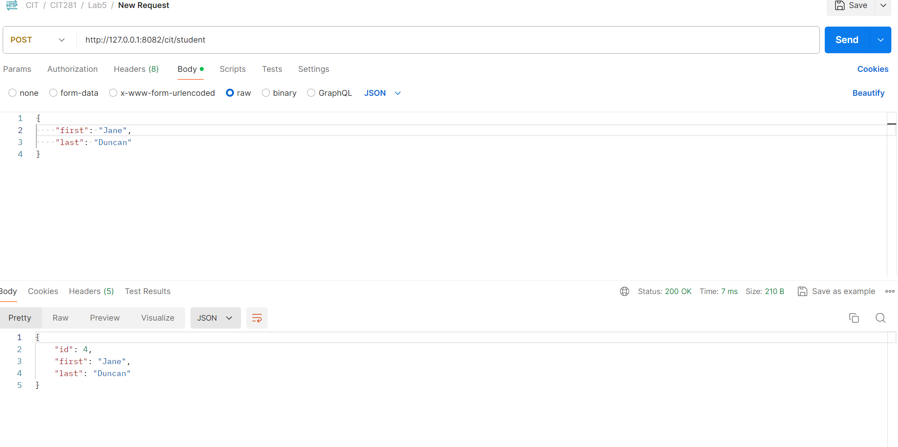

# Lab 5

## Purpose of the lab
This lab gave me much useful experience in using Postman API to test my requests and responses. I also gained more practice with handling the GET and POST routes.

## Technologies used 
- Javascript
- VS Code
- Postman

## What I learned from this Lab
During this lab, I learned...
- How to make a collection inside of Postman
- What different status codes look like to clients
- How to work with objects
- When to specify JSON vs html content type 

